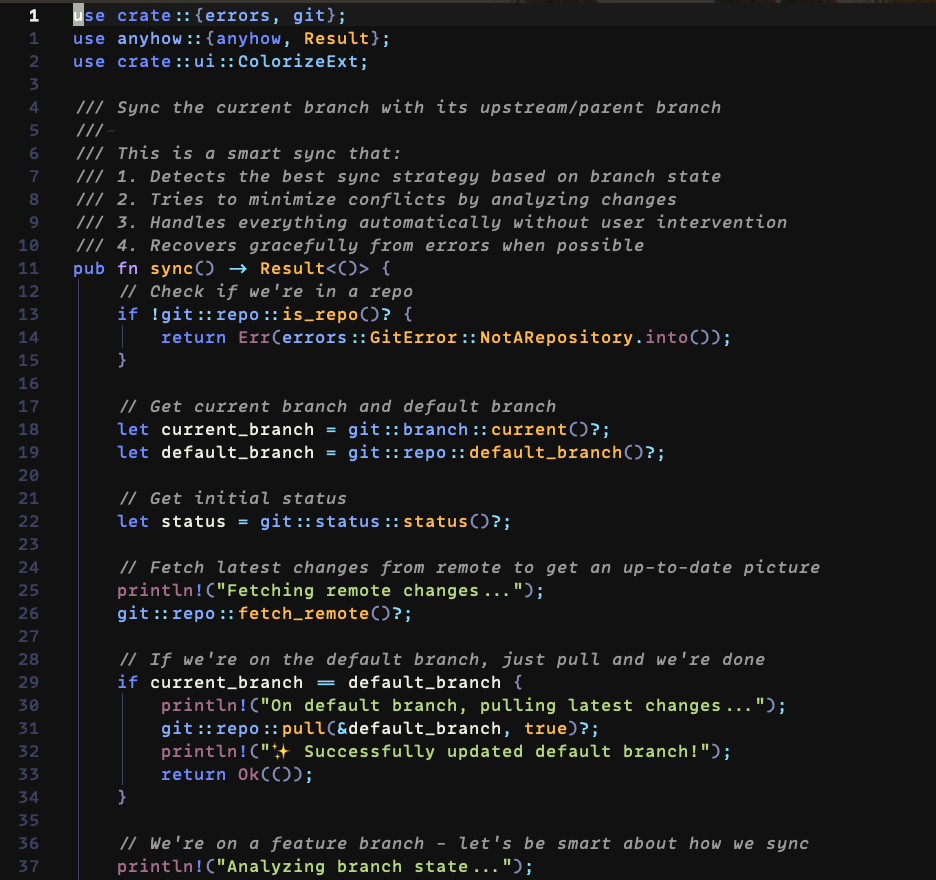

# 🌒 Lunaria Glow – VS Code Theme

A sleek **dark** color‑theme that keeps every hue from our Neovim/Prism palette, passes **WCAG AA** contrast, and adds a touch of pastel warmth to your code.



---

## ✨ Why Lunaria Glow?

* **Accessible & eye‑friendly** – ≥ 4.5 : 1 contrast for every token on the default background.  
* **Consistent across editors** – same palette is available for Neovim (`lunaria_glow.nvim`).  
* **Transparent‑ready** – UI colors intentionally keep contrast over glassy terminals.  
* **Lightweight** – no JavaScript, no runtime color recompute: pure JSON.

---

## 🚀 Quick Install

### Marketplace (recommended)

```bash
ext install foxycorps.lunaria-glow
```

or search **“Lunaria Glow”** in the Extensions view (<kbd>⇧⌘X</kbd>).

### Manual

1. Download `lunaria-glow-color-theme.json`.  
2. Place it in `~/.vscode/extensions/lunaria-glow/` (create the folder).  
3. In VS Code press <kbd>F1</kbd> → *Preferences: Color Theme* → **Lunaria Glow**.

---

## 🎛 Theme options

Lunaria Glow uses VS Code’s built‑in *Workbench > Appearance* settings.  
For a glassy look set `window.background` in your OS or custom CSS; the theme will show through while preserving readable pop‑ups and selections.

---

## 🎨 Palette

| Role / Scope              | Hex       |
|---------------------------|-----------|
| Background                | `#111111` |
| Foreground / default text | `#eeeee1` |
| Keyword / operator        | `#6d89ff` |
| Number / boolean          | `#ffb84a` |
| String / variable         | `#b3d77e` |
| Attribute value           | `#a36c8c` |
| Comment                   | `#999999` |
| Punctuation               | `#cccccc` |
| Diff + (added)            | `#76c490` |
| Diff – (removed)          | `#de7176` |

---

## 🧩 Developing & Debugging

```bash
# clone
git clone https://github.com/foxycorps/lunaria_glow
cd lunaria_glow

# install VS Code extension deps
npm install

# launch VS Code in extension dev mode
code --extensionDevelopmentPath=$(pwd)
```

In the Debug panel choose **“Launch Extension”** to open a second VS Code window with Lunaria Glow loaded from source.

---

## 📦 Publishing (for maintainers)

```bash
npm install -g vsce
vsce login foxycorps
vsce publish         # patch / minor / major flags optional
```

---

## 🤝 Contributing

Issues and PRs welcome! If a specific language or workbench element looks off:

1. Open an issue with a small code/sample screenshot.  
2. Fork → branch → `npm run dev` and tweak the JSON.  
3. Submit a PR with before/after images.

---

## 📜 License

[MIT](LICENSE) © foxycorps
